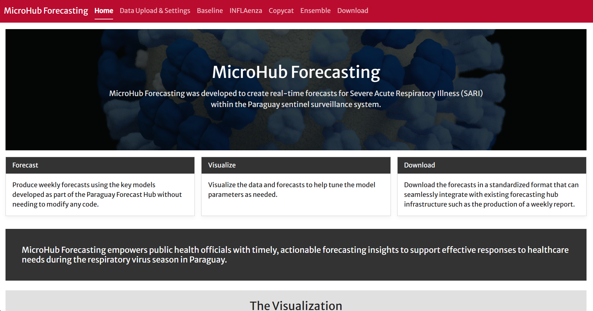

---
output:
  md_document:
    variant: gfm-implicit_figures
---

# The MicroHub Workshop

Welcome to the MicroHub Workshop. MicroHub is a local forecasting dashboard that helps public health teams upload surveillance data, run infectious disease forecast models, compare results, and export hub-ready probabilistic forecasts.

MicroHub home page screenshot: 

## Workshop Objectives

By the end of the workshop, participants should be able to:

- Describe core infectious disease forecasting concepts.
- Explain the forecast models included in MicroHub and when different models may be useful.
- Use MicroHub features to upload data, configure settings, generate forecasts, create ensembles, and download outputs.
- Summarize, evaluate, and communicate forecasts for public health decision-making.

## What Participants Will Need

- Windows, macOS, or Linux laptop with at least 8 GB RAM, 10 GB free disk space, and a processor capable of running Docker Desktop.
- Docker Desktop installed.
- The MicroHub Docker image downloaded in Docker Desktop.
- Workshop datasets from the [Downloads](articles/downloads.html) page.

## Start Here

- [Overview](articles/overview.html)
- [Start setup](articles/install.html)
- [Exercises](articles/exercises.html)
